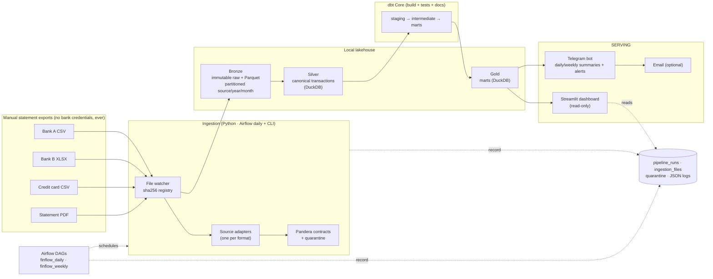

# FinFlow — Planning & Architecture Document

**Project:** FinFlow — Automated Personal Finance Intelligence Platform
**Status:** PLANNING — AWAITING APPROVAL (do not implement until `APPROVE PLAN — START IMPLEMENTATION`)
**Date:** 2026-09-12 · **Cost target:** ₹0 recurring, verified · **Data policy:** synthetic-only in any public artifact

---

## Decisions Log (owner-confirmed, 2026-09-12)

| Decision | Choice | Consequence |
|---|---|---|
| Orchestrator | **Apache Airflow** | Primary scheduler; DAGs stay thin over the CLI pipeline |
| Host machine | **< 8 GB RAM** | See "Low-RAM deployment design" below — Airflow is tuned hard; a `lite` profile (cron-style runner, no Airflow) ships as a built-in fallback |
| Notifications | **Telegram bot** | Primary + only notification channel in v1; email channel deferred (interface kept pluggable) |
| Public demo | **Yes** — Streamlit Community Cloud | M17 deploys a synthetic-data-only demo app; `DEMO_MODE` hard switch enforced in code |

### Low-RAM deployment design (mandatory for this machine)

- **Compose `full` profile (default):** Airflow with LocalExecutor, **no triggerer** (no deferrable operators used), single dag-processor, `parsing_processes=1`, `min_file_process_interval=60`, `parallelism=2`, `max_active_tasks_per_dag=1`, `worker_concurrency=1`. Postgres shared-buffers tuned down. Target: **≤ 2.5 GB steady-state** for the whole stack (Airflow + Postgres + dashboard).
- **Compose `lite` profile:** same pipeline, no Airflow — a single lightweight container running the `finflow` scheduler loop (or host cron). ~0.5 GB. Selected via `make lite` / `COMPOSE_PROFILES=lite`.
- Acceptance test added to M11/M14: measure and record container RSS on the real machine; if `full` profile exceeds 3 GB steady-state, the README documents `lite` as the recommended daily mode and Airflow as the demo/interview mode.

---

## A. Executive Summary

FinFlow will be a **local-first, fully Dockerized, batch ELT data platform** that ingests bank / credit-card / UPI statement files (CSV, XLSX, PDF) dropped into a watched folder, validates and normalizes them into one canonical transaction model, loads a **DuckDB** lakehouse (Bronze/Silver/Gold), transforms and tests it with **dbt Core**, and serves a **Streamlit** dashboard plus **Telegram/email** daily & weekly summaries and alerts — all scheduled by **Apache Airflow** running in Docker Compose, with a CI pipeline on GitHub Actions.

Recommended architecture in one line each:

- **Ingestion:** file-drop + content-hash registry → per-source adapters → Pandera schema validation → quarantine for bad records (never silent drops).
- **Storage:** immutable raw files + Parquet (Bronze) → DuckDB tables (Silver/Gold). No MinIO (community edition is effectively discontinued as of late 2025 — verified), no cloud object storage.
- **Transform:** dbt Core (Apache-2.0, verified free indefinitely; v2.0/Fusion engine open-sourced June 2026) with the `dbt-duckdb` adapter; dbt tests as the warehouse quality gate.
- **Serving:** Streamlit dashboard (6 pages, product-grade), Telegram bot (primary notifications), Gmail SMTP (secondary, app-password based).
- **Orchestration:** Airflow 3.x with thin DAGs over a CLI-first pipeline (`finflow ingest|process|build|notify|run-all`) — orchestrator is replaceable by cron with a config change.
- **Cloud:** none on the critical path. Optional free demo of the dashboard on Streamlit Community Cloud using synthetic data only.

Key verified findings that shaped the design (Sept 2026):

1. **AWS Free Tier changed on 2025-07-15**: new accounts get expiring credits (6 months), and a **credit card is mandatory** at signup → cloud rejected. 
2. **BigQuery sandbox** is card-free but **expires all tables after 60 days** and has no billing-account-free permanence → rejected as the primary warehouse.
3. **MinIO Community Edition** is effectively end-of-life (admin console stripped mid-2025, official binaries discontinued Oct 2025, repo archived, no security fixes) → rejected; local filesystem + Parquet is strictly better here.
4. **GitHub Actions** is free and unmetered for public repos (2,000 min/mo on private) → CI is safe at ₹0.
5. **Gmail SMTP** still works free but requires 2FA + app passwords (basic auth fully removed) → Telegram is the primary channel; email secondary.
6. **dbt Core remains Apache-2.0 "indefinitely"** per dbt Labs; the Fusion engine was open-sourced into dbt-core v2.0 in June 2026 → safe to build on; we pin versions.

Deliberate rejections (with reasons in §E/§L): PySpark, MinIO, Great Expectations, cloud warehouse, Superset/Metabase (default), Prometheus/Grafana, Kafka/streaming, Terraform (no cloud infra to manage), paid AI APIs.

Deliberate resume-driven inclusion (with mitigation): **Airflow** — the single most recognized orchestrator in DE job descriptions. Mitigated by the CLI-first design: the DAGs are thin wrappers; if Airflow is too heavy for your machine, switching to cron is a one-line change, not a rewrite.

---

## B. Problem Definition

**1. The human problem.** Money arrives through many rails (bank accounts, credit cards, UPI), and every institution exports statements in its own format. Manually consolidating them into "how much did I spend, on what, is anything wrong?" is tedious, so it doesn't happen daily. FinFlow automates the entire path from "I downloaded a statement" to "here's today's summary, this transaction looks unusual, you're at 86% of your food budget."

**2. The data engineering problem** (what makes this a real DE project, not a scripting exercise): heterogeneous sources → schema harmonization; dirty real-world data → validation + quarantine; duplicate statements → layered dedup; evolving category knowledge → override management; analytics → dimensional modeling and incremental marts; operations → orchestration, idempotency, observability, CI/CD.

**3. Users.**
- *Primary user:* you, single-user, running locally on your own machine; real data never leaves the machine.
- *Secondary audience:* recruiters/engineers evaluating the public repo — they see only synthetic data, a clean architecture, tests, and honest docs.

**4. MVP must accomplish (end of Milestone 8):**
- Drop 3+ differently-formatted CSV/XLSX files (3 synthetic bank formats) into `data/incoming/` → run one command → normalized, deduplicated, categorized transactions in DuckDB → marts built → dashboard shows them → Telegram daily summary sent. Idempotent: re-running changes nothing. Dirty rows land in quarantine with reasons. All covered by tests.

**5. Full production-style system additionally accomplishes (Milestones 9–18):** PDF ingestion, email-attachment intake, budgets & alerts, anomaly detection with severity, recurring-payment detection, weekly reports, dbt tests + docs, Airflow scheduling with retries, Ops/observability page, full Docker Compose one-command startup, GitHub Actions CI, screenshots + resume/LinkedIn portfolio pack.

**6. Intentionally out of scope (and why):**
- **Bank credential automation / account aggregators** (e.g., scraping internet banking, or paid AA APIs like Setu/Finvu free tiers) — security policy forbids handling bank logins; manual statement export is the trust boundary.
- **Real-time streaming** (Kafka/Flink) — statements are files; batch with ≤1-day latency is the correct engineering answer. Documented as a scale path, not built.
- **Multi-user web app with auth** — single-user local system; dashboard binds to localhost by default.
- **OCR for scanned PDFs** — text-based PDFs only in v1 (pdfplumber); OCR adds heavy deps for rare need.
- **Investments/net-worth tracking** — possible Phase 3; different data shape.
- **Any paid API, any LLM-based categorization** — rule/hybrid local ML only.

---

## C. MVP vs Full Version

| Capability | MVP (M1–M8) | Full system (M1–M18) |
|---|---|---|
| Sources | CSV + XLSX, 3 synthetic bank formats | + PDF (text-based), + email-attachment intake (IMAP, opt-in) |
| Orchestration | CLI (`finflow run-all`), Makefile | + Airflow 3 DAGs (daily, weekly) with retries & catch-up |
| Warehouse | DuckDB: Silver canonical + core marts | + dbt docs, incremental models, partitioned Bronze Parquet, backups |
| Data quality | Pandera contracts at ingestion + quarantine | + dbt test suite (uniqueness/NN/accepted values/relationships), freshness checks |
| Categorization | Rule engine (YAML merchant/keyword map) | + manual override store + dashboard override UI + optional local ML fallback |
| Insights | Daily metrics, top categories | + budgets/utilization alerts, robust z-score anomalies, recurring detection, weekly report |
| Notifications | Telegram daily summary | + email channel, alerting on anomalies/budget, ops alert on pipeline failure |
| Dashboard | Overview + Transactions pages | + Spending, Budgets, Insights, Ops (pipeline runs, quarantine) pages |
| CI/CD | GitHub Actions: lint + unit tests | + dbt build/test job, Docker build, compose config validation |
| Portfolio | README skeleton | Architecture diagrams, screenshots, demo deployment, resume bullets, LinkedIn text |

MVP rule: every milestone still ships tested and documented — "MVP" means fewer features, not lower quality.

---

## D. Candidate Architecture Options

### Option 1 — Local Lakehouse, Single Node (RECOMMENDED)

Local Docker stack: file-drop → Python adapters (Pandas + Pandera) → Parquet Bronze + DuckDB Silver/Gold → dbt Core → Streamlit + Telegram. Airflow for scheduling; everything else is a library, not a service.

- Components: `postgres (airflow metadata) + airflow scheduler/api-server/triggerer/dag-processor + dashboard`. RAM ≈ 2.5–3.5 GB. 
- Cost: ₹0 forever, no card anywhere. Blast radius: one machine, raw files retained = rebuildable everything.
- Interview coverage: ETL/ELT, modeling, dedup/idempotency, orchestration, data quality, dimensional marts, Docker, CI/CD, observability — ~90% of the target keyword list honestly earned.

### Option 2 — Minimalist Cron Stack (fallback / low-RAM variant)

Identical pipeline code; no Airflow, no Postgres. `cron` (or Windows Task Scheduler) invokes `finflow run-all` daily; logs + `pipeline_runs` table provide observability. RAM ≈ 0.7–1 GB.

- Pros: simplest, most robust, still demonstrates strong DE fundamentals. Cons: no Airflow UI/backfill/retry UX; weaker recruiter signal. **Kept as a supported deployment mode** — switching is a config flag, which is itself a good architecture talking point.

### Option 3 — Cloud-Native (S3 + Lambda triggers + MWAA/Airflow + BigQuery/Athena) — REJECTED as primary

- Verified blockers: AWS requires a credit card and post-July-2025 free tier is 6-month expiring credits; BigQuery sandbox expires tables in 60 days; a single misconfigured resource can bill real money. 
- What we keep: a written **"Cloud Extension"** design doc mapping each local component to its cloud equivalent (interview gold: shows you know *why* things exist, not just how to run them).

### Comparison

| Dimension | Opt 1 Local Lakehouse | Opt 2 Cron Minimal | Opt 3 Cloud |
|---|---|---|---|
| Recurring cost forever | ₹0 | ₹0 | ₹0 only while inside expiring free tiers — fragile |
| Credit card needed | No | No | Yes (AWS/GCP) |
| RAM needed | ~3 GB | ~1 GB | N/A (browser) |
| Data privacy | Data never leaves machine | Same | Data on cloud (synthetic only, still) |
| Reliability/maintainability | High | Highest | Fragile on free tiers |
| DE interview coverage | Very high | High | High but riskier to sustain |
| Maintenance effort | ~1 h/month | ~0.5 h/month | ~3+ h/month firefighting quotas |
| Failure blast radius | Local, rebuildable from raw | Local | Accidental billing risk |

**Decision:** Option 1 as default, Option 2 supported as a profile, Option 3 documented only.

---

## E. Technology Comparison (verified Sept 2026)

Legend: ✅ = selected · ❌ = rejected · 🟡 = optional/deferred. "Card?" = credit card required at signup/use.

| Technology | Purpose | Free? (verified) | Limits that matter | Card? | Local alternative | Decision |
|---|---|---|---|---|---|---|
| Python 3.11+ | Core language | Yes, PSF license | — | No | — | ✅ |
| DuckDB | Analytical warehouse (single file, embedded) | Yes, MIT | No practical limit at this scale (~10⁵–10⁷ rows fine) | No | — | ✅ primary warehouse |
| Parquet (local FS) | Bronze storage | Open format | — | No | — | ✅ |
| PostgreSQL | Airflow metadata DB | Yes, PostgreSQL license | — | No | — | ✅ (as Airflow backend only) |
| BigQuery sandbox | Cloud warehouse | Yes, but tables **expire in 60 days**, 10 GB storage, 1 TB scan/mo | Data expiry breaks persistence | No (card needed only for permanent free tier) | DuckDB | ❌ primary / 🟡 documented |
| Snowflake trial | Cloud warehouse | Trial only (14 days) | Expires | Yes | DuckDB | ❌ |
| MinIO | S3-compatible local object store | Community Edition **effectively EOL**: console stripped 2025, binaries discontinued Oct 2025, repo archived, no security fixes | — | No | Local FS + Parquet | ❌ |
| Pandas | Processing | Yes, BSD | Single-node memory | No | — | ✅ |
| PySpark | Distributed processing | Yes, Apache-2.0 | Needs JVM + ≥1–2 GB driver overhead; absurd at <10⁶ rows | No | Pandas | ❌ (documented scale path) |
| dbt Core | SQL transformations + tests + docs | Yes, Apache-2.0 **indefinitely** (v2.0/Fusion OSS June 2026) | — | No | raw SQL scripts | ✅ (pin version) |
| Apache Airflow 3 | Orchestration | Yes, Apache-2.0 | ~2–3 GB RAM in Docker | No | cron / Dagster | ✅ default (thin DAGs) |
| Dagster / Prefect OSS | Orchestration alternative | Yes, Apache-2.0 | Smaller community for DE roles | No | — | 🟡 runner-up |
| cron / Task Scheduler | Naive scheduling | OS built-in | No UI/retries | No | — | ✅ supported fallback mode |
| Pandera | DataFrame schema validation | Yes, MIT | — | No | custom validators | ✅ |
| Great Expectations | Data quality | GX Core OSS, Apache-2.0 | Heavy, verbose, slow test iteration for 1 dev | No | Pandera + dbt tests | ❌ |
| dbt tests | Warehouse-level quality gates | Yes, part of dbt | — | No | — | ✅ |
| Streamlit | Dashboard | Yes, Apache-2.0 | — | No | — | ✅ |
| Streamlit Community Cloud | Free public demo hosting | Yes: unlimited public apps from public repos, ~1 GB RAM, sleeps after 12 h idle | Demo must be synthetic-only (public!) | No | — | 🟡 demo deployment |
| Metabase CE / Superset | BI tools | Free (AGPL / Apache-2.0) | JVM, heavier stack, less brandable UI | No | Streamlit | ❌ default (🟡 optional profile) |
| Prometheus + Grafana | Monitoring | Free, OSS | Overkill; another 2 services to babysit | No | JSON logs + `pipeline_runs` tables + Ops page | ❌ |
| Docker Engine / Desktop | Containerization | Free for personal use | — | No | — | ✅ |
| GitHub Actions | CI/CD | Free **unlimited for public repos**; 2,000 min/mo private | Keep repo public → ₹0 | No | — | ✅ |
| Telegram Bot API | Notifications | Yes, free, no card | ~30 msg/s (irrelevant here) | No | — | ✅ primary channel |
| Gmail SMTP | Email notifications | Free with 2FA + **app password** (basic auth removed) | Google auth churn risk → secondary | No (Google account) | — | ✅ secondary |
| pdfplumber | PDF statement parsing | Yes, MIT | Text-based PDFs only | No | manual CSV export | ✅ |
| reportlab | Generate demo PDF statements | Yes, BSD | — | No | — | ✅ (datagen only) |
| openpyxl | XLSX parsing | Yes, MIT | — | No | — | ✅ |
| Typer / Pydantic / Plotly / pytest / ruff / mypy | CLI, config, charts, testing, linting, types | All free OSS | — | No | — | ✅ |
| Render/Railway/etc. free hosting | App hosting | Free tiers exist but spin down / restricted / churn | Not relied upon | Varies | Streamlit Cloud | ❌ |
| Paid AI APIs (categorization) | — | **No** | — | Yes | rules + optional sklearn | ❌ |

Cost-relevant sources: BigQuery sandbox terms [2](https://cloud.google.com/bigquery/docs/sandbox), [1](https://www.datacamp.com/tutorial/bigquery-sandbox); AWS free-tier restructuring + card requirement [1](https://cloudwebschool.com/docs/aws/fundamentals/aws-free-tier/), [2](https://dev.to/aws-builders/whats-new-in-aws-free-tier-2025-2ba5); MinIO communityedition collapse [1](https://github.com/LibreChat-AI/code-interpreter/issues/11), [3](https://blocksandfiles.com/2025/06/19/minio-removes-management-features-from-basic-community-edition-object-storage-code/); Streamlit Community Cloud limits [2](https://livemy.app/blog/deploy-streamlit-app), [1](https://webapps.hsma.co.uk/streamlit_community_cloud.html); GitHub Actions pricing [3](https://cicdpipelinecost.com/github-actions-pricing); Gmail app-password policy [1](https://www.geeksforgeeks.org/techtips/how-to-use-the-gmail-smtp-server-to-send-emails-for-free/), [3](https://www.getmailbird.com/gmail-oauth-changes-app-password-phase-out/); dbt Core license commitment [2](https://www.getdbt.com/licenses-faq), [1](https://github.com/dbt-labs/dbt-fusion/blob/main/docs/roadmap/2025-05-new-engine-same-language.md).

---

## F. Recommended Architecture



**Components & why each earns its place**

| Component | Choice | Why it earns its place |
|---|---|---|
| Language | Python 3.11+ (pinned) | DE lingua franca; typed, testable |
| CLI-first pipeline | `finflow` (Typer): `ingest`, `process`, `build`, `notify`, `run-all` | Every capability usable without Airflow; DAGs stay thin; testable in CI without orchestration |
| Ingestion registry | `ingestion_files` table keyed by sha256 | File-level idempotency, full audit |
| Adapters | One class per source format; registry pattern; new bank = new adapter + YAML config | Isolates format chaos from the pipeline |
| Validation | Pandera contracts (boundary) + dbt tests (warehouse) + business rules (balance continuity, future dates) | Two independent quality nets; bad rows → quarantine with error codes |
| Storage | Files: `data/raw` (immutable originals) + Bronze Parquet partitioned `source/year/month`; Warehouse: single DuckDB file | Raw is the rebuild-everything source of truth; DuckDB = zero-ops columnar analytics |
| Transform | dbt Core + dbt-duckdb | SQL models, lineage, docs, tests, incremental patterns — the industry-standard ELT layer |
| Orchestration | Airflow 3 (LocalExecutor-style, Postgres metadata), 2 DAGs | Scheduling, retries, backfill, UI; the recognized DE skill |
| Dashboard | Streamlit + Plotly, custom CSS theme | Fastest path to "looks like a real product"; reads DuckDB **read-only** |
| Notifications | Telegram bot (primary), Gmail SMTP (secondary) | Both verified free, no card; channel abstraction so both are plugins |
| Observability | Structured JSON logs + `pipeline_runs`/`ingestion_files`/`quarantine` tables + dashboard Ops page | Observable without running Prometheus/Grafana |
| CI/CD | GitHub Actions: ruff → mypy → pytest (unit+integration) → dbt build+test on synthetic seed → docker build | Free on public repos; quality gate for every push |

**Explicitly removed from the naive architecture and why:** S3 + event triggers (files-on-one-machine don't need object storage; a scheduled scan of `incoming/` gives the same outcome), MinIO (dying CE, zero value here), PySpark (no data volume justification), Great Expectations (Pandera+dbt cover the need with 10× less friction), cloud warehouse (card/expiry issues), Superset/Metabase (Streamlit gives a more product-like, customizable UI), Kafka/streaming (batch is correct for statements), Terraform (no cloud resources to declare — a Makefile + compose file *is* the infrastructure definition).

**Airflow honesty note:** for one user, cron is *sufficient*. Airflow is chosen for genuine orchestration benefits (retries, backfill, dependency graph, UI) **and** recruiter relevance, with the CLI-first design ensuring the choice is reversible in minutes. That trade-off is documented in the repo's ADRs.

---

## G. Complete Data Flow

```text
 1. You export a statement from the bank app → drop file into data/incoming/<source_id>/
 2. Daily DAG tick (21:30 IST) or `finflow ingest`:
    scan incoming/ → sha256 each file → compare with ingestion_files registry → skip known files
 3. New file → archived to data/raw/<source>/YYYY/MM/ (immutable, never modified again)
 4. Format detection → source adapter parses (CSV/XLSX/PDF) → raw rows
 5. Pandera contract validation:
      valid rows   → Bronze Parquet (partitioned source/year/month)
      invalid rows → quarantine/ (Parquet + quarantine table, with error codes)  [file never blocks others]
 6. Normalize → canonical schema: deterministic transaction_id, amounts→paise (int), dates→DATE, ts→IST,
    merchant normalization, direction, payment method, account resolution
 7. Dedup (layered): file-hash skip → anti-join on transaction_id (MERGE) → dbt uniqueness test
 8. dbt build: staging → intermediate (dedup, category join, transfer tagging) → marts
    (daily/weekly/monthly metrics, budget status, anomalies, recurring)
    dbt tests gate the build: uniqueness, not_null, accepted_values, relationships, freshness
 9. Anomaly job: robust z-score (median/MAD) per category & merchant on trailing 90 days → severity + reason
10. Recurring job (weekly): merchant+amount clustering, interval regularity → next expected date
11. Notify: daily/weekly summary via Telegram (+ email); high-severity anomalies & budget breaches → alert;
    pipeline failures → ops alert. Notification failure never fails the pipeline (soft-fail, retried next run)
12. Dashboard (read-only DuckDB connection) renders Overview / Spending / Budgets / Insights / Transactions / Ops
13. Observability: every run writes pipeline_runs (status, timings, rows in/out, rejected); JSON logs on disk
14. Backups: nightly DuckDB EXPORT to backups/ + raw files retained → warehouse fully rebuildable
```

Failure branches: malformed file → `status=REJECTED`, ops alert, pipeline continues with other files; schema drift (bank changes columns) → contract fails → quarantine + alert → fix = extend adapter (documented runbook); partial load crash → file marked `PARTIAL`, re-run reprocesses it atomically (staging→swap).

---

## H. Data Model

### Canonical transaction schema (Silver — `fact_transactions`)

| Field | Type | Null | Notes |
|---|---|---|---|
| `transaction_id` | TEXT (PK) | No | Deterministic: SHA-256 of (source_system ‖ account_id ‖ txn_date ‖ amount_paise ‖ normalized_description ‖ occurrence_rank) → 32-hex. Re-derivable ⇒ idempotent |
| `account_id` | TEXT (FK→dim_account) | No | Surrogate; e.g. `hdfc_savings_primary` |
| `txn_date` | DATE | No | As printed on statement (local date) |
| `txn_ts` | TIMESTAMP | Yes | IST when time available (UPI), else NULL |
| `description_raw` | TEXT | No | Verbatim from source |
| `description_norm` | TEXT | No | Trimmed/casefolded, reference numbers masked |
| `merchant` | TEXT | Yes | Normalized merchant (rule-matched) |
| `amount_paise` | INTEGER | No | Absolute magnitude in paise — no floats for money |
| `direction` | ENUM(in,out) | No | Money in / out |
| `signed_amount` | DECIMAL(18,2) | No | Derived (+in/−out) for convenience |
| `currency` | TEXT | No | ISO-4217, default INR |
| `txn_type` | ENUM(purchase, income, transfer, refund, fee, interest, atm, autopay, other) | No | |
| `payment_method` | ENUM(upi, card, netbanking, cash, autopay, unknown) | Yes | |
| `category` / `subcategory` | TEXT | No | Default `Uncategorized`; from rules + overrides |
| `is_transfer` | BOOLEAN | No | Excluded from expense metrics (prevents double counting) |
| `source` / `source_file_id` | TEXT / TEXT (FK→ingestion_files) | No | Lineage |
| `row_hash` | TEXT | No | Hash of the raw record (audit) |
| `ingested_at` / `updated_at` | TIMESTAMP | No / Yes | UTC |

**Keys & dedup.** *Natural key:* (account_id, txn_date, amount_paise, description_norm) — banks don't issue reliable transaction IDs in exports. *Identical-leg problem:* two identical coffees same day → `occurrence_rank` (rank within the natural-key group, ordered by stable source row order) disambiguates deterministically. *Dedup layers:* (1) file sha256 registry, (2) MERGE/anti-join on `transaction_id`, (3) dbt uniqueness test as a hard gate. *Duplicate-charge detector:* same merchant+amount within 24 h → flagged as an alert (kept, not deleted — the bank decides reversals).

**Dimensions & marts (Gold).** `dim_account` (account, institution, type, currency), `dim_date` (calendar), `dim_category` (category, subcategory hierarchy, budget join), plus marts: `mart_daily_summary`, `mart_weekly_summary`, `mart_monthly_category`, `mart_budget_status`, `mart_top_merchants`, `mart_anomalies` (txn_id, method, baseline, score, severity, reason), `mart_recurring` (merchant, cadence, typical amount, last/next expected, confidence).

**SCD / mutability.** Transactions are immutable facts. The one evolving attribute — category — is handled as: base category from rules + `category_overrides` table (Type-1 with audit columns); marts always apply the latest override. Override rules are YAML in git → versioned, reviewable.

**Partitioning & indexing.** Bronze Parquet partitioned by (source, year, month) → pruned scans; fact ordered by `txn_date` for DuckDB zone-map efficiency; DuckDB ART indexes auto-created on PK/UNIQUE — no manual index tuning needed at this scale (documented reasoning in ADR).

**Ingestion metadata.** `ingestion_files` (file_id PK, source, filename, sha256, bytes, received_at, processed_at, status ∈ {RECEIVED, PARSED, LOADED, PARTIAL, REJECTED}, row_count, valid_count, rejected_count, error_summary, run_id). `quarantine_rows` (file_id FK, row_number, raw_payload JSON, error_codes[], detected_at) + Parquet copy under `data/quarantine/`. `pipeline_runs` (run_id, dag/CLI, started/ended, status, rows_in/out/rejected, dbt_test_results, error).

**Configuration as data.** `config/sources.yaml` (accounts + adapter mappings), `config/categories.yaml` (merchant/keyword rules), `config/budgets.yaml` (monthly category budgets), all read via typed Pydantic settings; secrets only via `.env`.

---

## I. Security & Privacy Design

Threat model → controls:

| Threat | Control |
|---|---|
| Real finances leaking via the public repo | `data/` fully gitignored except `data/sample/` (synthetic, committed); CI job asserts no real-looking account numbers in tracked files; screenshots only from the synthetic demo dataset |
| Bank credential exposure | Never requested, never stored, never automated. Manual export is the trust boundary (documented prominently) |
| Secrets in git | `.env` gitignored + `.env.example` template; Pydantic-settings fail-fast if secrets missing; no secret ever logged (log sanitizer + structured logging of IDs/counts, not payloads) |
| Secrets in container layers | Compose reads `.env` at runtime; images contain no secrets |
| Dashboard exposure | Binds `127.0.0.1` by default; the demo deploy uses a synthetic-only database explicitly built for publicity |
| Notification leakage | Telegram bot posts only to your `chat_id`; summaries contain amounts you already see; email optional and off by default |
| Token/credential theft scope | Telegram token + chat id, Gmail **app password** (revocable, 2FA-gated) — no bank tokens exist |
| Data loss | Raw files immutable + retained; nightly DuckDB export to `backups/`; full rebuild from raw is a tested command |
| PDF ingestion risk | Parser processes local files only; no JS/macros executed; malformed PDFs → quarantine |

Data-handling invariants (checked in code review + tests): no network call touches a real-data path except outbound notifications (which you trigger); demo mode (`DEMO_MODE=true`) forces synthetic DB.

---

## J. Cost Analysis — proof of ₹0

| Item | Service/plan | Card required? | Recurring cost | Why it stays ₹0 |
|---|---|---|---|---|
| Compute | Your existing machine + Docker (free personal) | No | ₹0 | All processing local |
| Warehouse | DuckDB (embedded, MIT) | No | ₹0 | Library, not a service |
| Object storage | Local filesystem | No | ₹0 | Parquet files on your disk |
| Transforms | dbt Core (Apache-2.0) | No | ₹0 | OSS, committed indefinitely |
| Orchestration | Airflow 3 OSS in Docker | No | ₹0 | OSS; uses local Postgres |
| Dashboard | Streamlit OSS | No | ₹0 | OSS |
| Demo hosting (optional) | Streamlit Community Cloud | No | ₹0 | Free tier for public repos (verified) |
| CI/CD | GitHub Actions, public repo | No | ₹0 | Unlimited minutes for public repos (verified) |
| Notifications | Telegram Bot API | No | ₹0 | Free, no quota that matters |
| Email (optional) | Gmail SMTP + app password | No (Google account) | ₹0 | Free; not on critical path |
| Domain/SSL | None (localhost + streamlit.app subdomain) | No | ₹0 | Not needed |

**Total: ₹0/month, ₹0/year, ₹0 one-time.** No component sits on a free *trial*; no component requires a card; no component's critical path dies if a free tier is withdrawn (worst case: Streamlit Cloud demo goes away — cosmetic only; the platform is local).

---

## K. Architecture Risks

| # | Risk | L | I | Mitigation |
|---|---|---|---|---|
| 1 | Airflow too heavy for your machine (<8 GB RAM — **confirmed**) | M | M | Low-RAM design: no triggerer, 1 parsing process, parallelism=2, tuned Postgres → target ≤2.5 GB steady-state; `lite` profile (cron runner, ~0.5 GB) ships as first-class fallback; measured-RSS acceptance test in M14 |
| 2 | DuckDB single-writer vs dashboard | M | L | Dashboard opens read-only connection; writes only in pipeline; nightly backup |
| 3 | Bank changes CSV format/columns | H | M | Pandera contract → fail fast → quarantine + ops alert; adapter per bank isolates the fix; runbook doc |
| 4 | PDF extraction fragility across statements | H | M | v1 supports text-based PDFs; unsupported layouts → clear rejection message + manual CSV path; never silently wrong numbers |
| 5 | Identical-transaction ID collisions / dedup errors | M | H | occurrence_rank scheme + property-based tests + dbt uniqueness gate + duplicate-charge alert detector |
| 6 | Wrong categorization | H | L | Rules YAML in git; dashboard override UI (writes to `category_overrides`); "top uncategorized" surface; optional local ML later |
| 7 | Notification outage (Telegram/Gmail) | M | L | Channel abstraction; soft-fail + retry next run; dashboard still shows summary; ops log |
| 8 | DuckDB file corruption | L | H | Nightly EXPORT backup; full rebuild from immutable raw + Parquet is a tested command |
| 9 | Streamlit Cloud demo limits (1 GB / sleeps) | M | L | Demo uses a small synthetic warehouse; it's a showcase, not the product |
| 10 | Timezone/currency bugs (IST, paise) | M | M | Integer paise, explicit IST policy, single date/time utility module, tests around boundaries |
| 11 | Inter-account transfers double-counted as expenses | H | M | `is_transfer` tagging + transfers excluded from expense metrics; optional transfer-pair matching (stretch) |
| 12 | Scope creep kills the project | M | H | Milestone gates with acceptance criteria; MVP freeze at M8; portfolio assets mandatory milestones |

---

## L. Architecture Improvements After Challenging It (Phase-3 self-review)

Answers to the exact challenge questions:

| Challenge | Outcome / design change |
|---|---|
| Is every component necessary? | Cut from v1 draft: MinIO (dead CE — verified), Great Expectations, PySpark, S3/event triggers, cloud warehouse, Grafana. Each cut documented in an ADR with the triggering question |
| Is this over-engineered? | Airflow is the borderline case → mitigated via CLI-first thin DAGs + supported cron mode. dbt justified by tests/lineage/docs it gives nearly free |
| Can this be free forever? | Every critical-path item is OSS running locally. Verified: no trials, no cards. Streamlit Cloud demo is the only hosted piece and is optional |
| What if a service disappears? | Worst case = Telegram or Gmail notification channel (swap-in replacement); Streamlit Cloud demo (cosmetic). Core platform has zero SaaS dependencies |
| Malformed file? | Contract fails → file REJECTED + quarantined rows + ops alert; other files unaffected; runbook for adding/fixing adapters |
| Pipeline runs twice? | File-hash registry + deterministic transaction_ids + MERGE ⇒ byte-identical warehouse; test `run twice → equal row counts` in CI |
| Bank changes format? | Adapter-level contract violation is loud, quarantined, and localized; adding a column = adapter + schema update only |
| Categorization wrong? | Override store + dashboard UI; overrides are data (audit-trailed), rules are config (git-versioned) |
| Notification fails? | Soft-fail; retried next run; never blocks data correctness |
| Warehouse unavailable? | Ingestion stops at Bronze (raw preserved); processing resumes when DuckDB returns; no data loss possible before the warehouse |
| Spark justification? | None below ~10⁶ rows; documented "scale path" (swap processing engine + warehouse) instead of running a JVM to print one dashboard |
| Event-driven S3 triggers? | Replaced by scheduled + on-demand file scan — same outcome, no object store, no billing surface |

Additional hardening added during review: quarantine always paired with machine-readable error codes; dbt tests gate notifications (bad data is never reported as good); demo mode hard-switches every service to the synthetic DB; transfers excluded from spend metrics.

---

## M. Detailed Implementation Roadmap

Effort: ~60–75 focused hours total. Each milestone ends with green tests before the next begins.

**M1 — Repository & Environment (2–3 h).**
Files: repo skeleton (`src/finflow` package layout), `pyproject.toml` (deps, ruff/mypy/pytest config), `Makefile`, `.gitignore`, `.env.example`, `LICENSE` (MIT), `README.md` stub, `docs/adr/0001…`. Steps: uv/pip env, pre-commit, `finflow --help` works. Tests: CI lint job green. Accept: one-command dev setup documented.

**M2 — Synthetic Data Generator (5–6 h).**
Files: `datagen/` (seeded generator: merchant catalog with price distributions, 2 salaries, subscriptions, rent, UPI micro-txns, 4 accounts; dirt injection: ~2% exact duplicates, nulls, negative amounts, future dates, unknown merchants, injected outliers; CSV in 3 bank formats + XLSX + reportlab PDF). Tests: determinism (same seed → same sha256), dirt rates within tolerance. Accept: `make demo-data` produces a realistic 12-month multi-account corpus; zero real-data resemblance risk.

**M3 — Ingestion (6–7 h).**
Files: `ingest/registry.py` (sha256, `ingestion_files`), `ingest/watcher.py` (scan `incoming/`), `ingest/adapters/{base,csv,xlsx,pdf}.py` + `config/sources.yaml`, raw archiver. Deps: M2. Tests: new-file detection, re-run skips, per-source routing, failed parse isolates file. Accept: drop 4 files → 4 archived + registered; drop again → 0 processed.

**M4 — Data Validation (4–5 h).**
Files: `ingest/contracts.py` (Pandera schemas per source + canonical), `ingest/quarantine.py` (error codes Q01–Qnn), business rules (future dates, amount ≤ 0, balance continuity when present). Tests: each error code triggered by a fixture; partial-file quarantine. Accept: dirty demo file → valid rows loaded, bad rows in quarantine with reasons, pipeline exit 0.

**M5 — Normalization (5 h).**
Files: `pipeline/normalize.py` (canonical schema, paise conversion, IST handling, merchant normalization, direction inference per adapter, occurrence_rank). Tests: golden-file tests per adapter; money round-trip; identical-leg rank stability. Accept: 3 heterogeneous formats → one identical-shape Silver table.

**M6 — Deduplication & Idempotency (3–4 h).**
Files: `pipeline/dedupe.py` (MERGE/anti-join on transaction_id), duplicate-charge detector hook. Tests: exact-dup file, cross-file overlap, in-file identical legs, rerun-idempotency property test. Accept: 2× runs and overlapping files ⇒ row count invariance (asserted in CI).

**M7 — Warehouse (4 h).**
Files: `warehouse/client.py` (read-only vs write connections), schema DDL/migrations, Bronze Parquet writer (partitioned), backup/restore commands (`finflow backup|restore`). Tests: concurrent read during write; rebuild-from-raw equivalence. Accept: `make warehouse-reset` rebuilds warehouse purely from raw + Parquet, hashes match.

**M8 — dbt (6–7 h).** *(MVP gate)*
Files: `dbt/finflow/` sources→staging→intermediate→marts, `schema.yml` tests (unique/not_null/accepted_values/relationships), macros (date spine, paise→rupees), docs generate. Tests: `dbt build` in CI against seeded warehouse; failing-test gates downstream steps. Accept: full marts + passing test suite + `dbt docs` served; **MVP demo: drop files → `make run-all` → dashboard + Telegram summary.**

**M9 — Categorization (5–6 h).**
Files: `categorize/rules.py` (YAML rule engine: exact/regex/keyword precedence), `config/categories.yaml` (~150 curated merchants), `category_overrides` store + `finflow override` command. Tests: precedence, override wins, uncategorized report. Accept: ≥95% of synthetic corpus categorized; overrides persist across rebuilds.

**M10 — Anomaly Detection (4–5 h).**
Files: `insights/anomalies.py` (robust z-score median/MAD per category & merchant, trailing 90 d, fallback IQR when MAD=0, severity bands, plain-English reasons), budgets checker. Tests: statistical edge cases (zero variance, tiny history), injected outliers all caught with expected severity. Accept: generator's planted anomalies appear in `mart_anomalies` with correct explanations; no false alarm storm (rate bounded in test).

**M11 — Airflow (5–6 h).**
Files: custom Airflow image (package + dbt baked in), `dags/finflow_daily.py` (ingest→normalize→dedupe→dbt build→metrics→notify; retries, SLA-less simple alerts), `dags/finflow_weekly.py` (weekly report + recurring refresh), `docker-compose.override` tuning. Tests: DAG import tests, `airflow dags test` locally. Accept: scheduled daily run processes a dropped file end-to-end unattended; failed task retries and alerts.

**M12 — Dashboard (7–8 h).**
Files: `dashboard/app.py` + pages (Overview, Spending, Budgets, Insights, Transactions, Ops), theme CSS, Plotly charts, KPI cards, filters, override UI, CSV export, read-only DB. Tests: Playwright-free smoke tests (import + query helpers unit-tested); screenshot script. Accept: product-grade UI on synthetic data; Ops page shows runs/quarantine.

**M13 — Notifications (4–5 h).**
Files: `notify/channels/{telegram,email}.py` (channel interface), templated daily/weekly/budget/anomaly/ops messages (₹-formatted, HTML for email). Tests: renderer golden tests (mock transport), soft-fail behavior. Accept: real Telegram message from real pipeline run; failure of channel ≠ failed pipeline.

**M14 — Docker (4–5 h).**
Files: hardened `Dockerfile` (non-root, multi-stage), full `docker-compose.yml` (postgres, airflow trio, dashboard, init), healthchecks, volume layout, `.env` wiring, Make targets (`up`, `down`, `logs`, `reset-demo`). Tests: compose config validation in CI; fresh-clone `docker compose up` smoke test. Accept: **one command from clone to working platform** on a clean machine.

**M15 — CI/CD (3–4 h).**
Files: `.github/workflows/ci.yml` (ruff → mypy → pytest → dbt build+test → docker build), badge, branch protection suggestion. Tests: red/green verification. Accept: every push gated; public repo ⇒ ₹0.

**M16 — Documentation (4–5 h).**
Files: full README (problem, architecture diagram, features, quickstart, screenshots, design decisions, limitations, roadmap), ADR set, `docs/scaling.md` (local→Spark/cloud mapping), runbooks (new bank adapter, format drift, restore). Accept: a stranger can run and understand the project from the README alone.

**M17 — Deployment (2–3 h).**
Files: Streamlit Cloud config for the synthetic demo app, repo metadata (topics, description, social preview), tagged release v1.0. Accept: live demo URL (synthetic data only) + polished repo.

**M18 — Portfolio Assets (3–4 h).**
Files: `docs/portfolio/resume-bullets.md` (3–5 honest, metric-backed bullets), LinkedIn project description, interview talking-points doc (idempotency, dedup, medallion, testing pyramid, why-not-Spark). Accept: you can describe every decision and its trade-off in an interview.

---

## N. Acceptance Criteria (final success gate)

**Functional** — each verified by an actual command/test, not claims:
- [ ] New file in `incoming/` processed automatically within one scheduled run (demo: scheduled run observed)
- [ ] CSV + XLSX + PDF adapters pass golden-file tests; 3 bank formats coexist
- [ ] 100% of rows land in exactly one of: Silver, quarantine (verified by reconciliation test)
- [ ] `run twice` test: identical row counts & warehouse hash (idempotency, in CI)
- [ ] Overlapping statements dedupe (cross-file test)
- [ ] ≥95% categorization on synthetic corpus; overrides survive rebuild
- [ ] Planted anomalies detected with correct severity; budgets produce utilization + breach alerts
- [ ] Recurring detection finds all planted subscriptions with correct cadence
- [ ] Daily & weekly summaries delivered via Telegram; weekly includes WoW comparison
- [ ] Dashboard 6 pages render on synthetic data; Ops page shows run history/quarantine
- [ ] Incremental: only new files parsed (log/metadata evidence); dbt incremental model verified

**Engineering:** `docker compose up` works from clean clone · CI green on GitHub · pytest suite ≥ 80% on core modules · dbt tests enforce uniqueness/NN/accepted values · structured JSON logs with zero secret leakage (log-scrubber test) · all config via YAML/.env (no hardcoded paths — enforced by test) · README quickstart reproduced on a fresh directory.

**Cost:** every dependency audited against the §E table · zero card-required services · zero trial-dependent services (grep-able check: no "trial" in any setup doc).

**Portfolio:** architecture diagram (Mermaid) in README · synthetic dataset in repo · ≥4 dashboard screenshots from demo data · resume bullets with honest, computed metrics (e.g., rows processed, test count, quarantine rate) · LinkedIn description · demo URL.

---

## O. Questions / Assumptions Needing Your Decision

**Assumptions I will proceed with unless you object:**
1. Single user, INR currency, IST timezone; amounts stored as integer paise.
2. Machine: your laptop/desktop, Docker installed; platform needn't run 24/7 — the daily DAG catches up when you boot (or you run `make run-all` manually).
3. Real data stays 100% local; the public repo and any demo contain only generator-produced synthetic data.
4. Manual statement export from bank apps is the ingestion trust boundary — no credential automation, ever.
5. Python 3.11+; MIT license for the repo.

**Decisions I need from you** (submitted as interactive questions):
1. Orchestrator: Airflow (recommended) vs cron-minimal vs Dagster — driven by your RAM and interview goals.
2. Your machine's RAM (Airflow feasibility).
3. Notification channel: Telegram (recommended) / Gmail / both.
4. Public synthetic-data demo on Streamlit Community Cloud: yes / no / later.

---

**END OF PLANNING PHASE.** Implementation begins only on: `APPROVE PLAN — START IMPLEMENTATION`.
